## Evaluation
{:#evaluation}

In this section, we evaluate our bidirectional archiving approach by comparing our implementation to native OSTRICH and other systems.

### Implementation
{:#evaluation-implementation}

We have implemented our storage approach and query algorithms as a tool called COBRA (Change-Based Offset-Enabled Bidirectional RDF Archive).
COBRA is an extension of OSTRICH, has been implemented in C/C++, and is available under the MIT license on [GitHub](https://github.com/rdfostrich/cobra){:.mandatory}.
Our implementation uses [HDT](cite:cites hdt) as snapshot technology,
and makes use of the highly efficient memory-mapped B+Tree implementation [Kyoto Cabinet](http://fallabs.com/kyotocabinet/){:.mandatory} for storing our indexes.
The delta dictionary is encoded with [gzip](http://www.gzip.org/), which requires decompression during querying and ingestion.

### Experimental Setup
{:#evaluation-setup}

In order to evaluate the ingestion and triple pattern query execution of COBRA,
we make use of the [BEAR benchmark](https://aic.ai.wu.ac.at/qadlod/bear.html){:.mandatory}.
To test the scalability of our approach for datasets with few and large versions, we use the BEAR-A benchmark.
We use the first ten versions of the BEAR-A dataset (more versions cause memory issues with OSTRICH),
which contains 30M to 66M triples per version.
This dataset was compiled from the [Dynamic Linked Data Observatory](http://swse.deri.org/dyldo/).
To test for datasets with many smaller versions, we use BEAR-B with the daily and hourly granularities.
For the daily dataset we use 89 versions and for hourly dataset 1,299 versions,
both of them have around 48K triples per version.
All experiments were performed on a 64-bit Ubuntu 14.04 machine with a 24-core 2.40 GHz CPU and 128 GB of RAM.
Our experimental setup and its raw results are available on [GitHub](https://github.com/rdfostrich/cobra/tree/master/Experiments/){:.mandatory},
as well as [the scripts that were used to process them](https://github.com/rdfostrich/cobra-bear-results/){:.mandatory}.

Considering we aim to measure the benefits of the bidirectional aggregated delta chain
compared to the unidirectional aggregated delta chain under the hybrid storage strategy,
we primarily distinguish between the following storage approaches:

* **OSTRICH**: Forward unidirectional aggregated delta chain ()
* **COBRA\***: Bidirectional aggregated delta chain before fix-up ()
* **COBRA**: Bidirectional aggregated delta chain after fix-up ()

In order to achieve a more complete comparison with other approaches,
we also evaluate BEAR's Jena (IC, CB, TB and hybrid CB/TB) and HDT-based (IC and CB) RDF archive baseline implementations.
We consider a comparison with other systems such as X-RDF-3X, RDF-TX and Dydra
out of scope for this work due to the major difficulties we experienced with these systems
caused by missing implementations or the additional required implementation effort to support the required query interfaces.

<figure id="evaluation-storage-approaches" class="figure">

<figure id="evaluation-storage-approaches-ostrich" class="subfigure">

<figcaption markdown="block">
OSTRICH with a forward unidirectional aggregated delta chain &nbsp;&nbsp;&nbsp;
</figcaption>
</figure>

<figure id="evaluation-storage-approaches-cobra-star" class="subfigure">

<figcaption markdown="block">
COBRA* with a bidirectional aggregated delta chain *before* fix-up &nbsp;&nbsp;&nbsp;
</figcaption>
</figure>

<figure id="evaluation-storage-approaches-cobra" class="subfigure">

<figcaption markdown="block">
COBRA with a bidirectional aggregated delta chain *after* fix-up (ingested out-of-order starting with snapshot)
</figcaption>
</figure>

<figcaption markdown="block">
The different storage approaches used in our experiments for an arbitrary dataset with six versions.
</figcaption>
</figure>

In the scope of this work, we work with at most two delta chains.
For simplicity of these experiments, we always start a new delta chain in the middle version of the dataset
(5 for BEAR-A, 45 for BEAR-B Daily, 650 for BEAR-B Hourly).
Note that for the COBRA storage approach, we assume that all versions are available beforehand,
so they can be stored out of order, starting with the middle snapshot.
For example, following the out-of-order ingestion algorithm from ,
for BEAR-A, this will first lead to the creation of a snapshot for version 5,
the creation of a reverse delta chain for versions 0-4,
and finally the creation of a forward delta chain for versions 6-9.
In practise, this may not always be possible, which is why we report on the additional fix-up time during ingestion separately
that would be required when ingestion in order (COBRA\*).

To evaluate triple pattern query performance,
we make use of the query sets provided by BEAR.
BEAR-A provides 7 query sets containing around 100 triple patterns that are further divided into high result cardinality and low result cardinality. 
BEAR-B provides two query sets that contain `?P?` and `?PO` queries.
We evaluate these queries as VM queries for all version, DM queries between the first and all other versions and a VQ query.
In order to minimize outliers, we replicate the queries five times and take the mean results.
Furthermore, we perform a warm-up period before the first query of each triple pattern.
Since neither OSTRICH nor COBRA support multiple snapshots for all query atoms,
we limit our experiments to OSTRICH’s unidrectional storage layout and COBRA’s bidirectional storage layout with a single snapshot.

### Measurements
{:#evaluation-results}

In this section, we discuss the results of our experiments on ingestion and query evaluation,
which we then analyze in the next section.

#### Ingestion

 and  respectively show the total storage sizes and ingestion times
for BEAR-A, BEAR-B Daily, and BEAR-B Hourly under the different storage approaches.

When purely comparing the COBRA approaches and OSTRICH, it can be observed that
COBRA requires less storage space than OSTRICH for BEAR-A and BEAR-B Hourly, but not for BEAR-B Daily.
COBRA* requires more storage space than both COBRA and OSTRICH with BEAR-A, but it requires less ingestion time.
For BEAR-B Daily, OSTRICH requires less storage, but COBRA* has the lowest ingestion time.
For BEAR-B Hourly, COBRA* is lower in terms of storage size and ingestion time than both COBRA and OSTRICH.
In summary, COBRA requires less ingestion time than OSTRICH in all cases (59% less on average),
and it reduces storage size for two out of the three cases (19% lower on average).

Compared to the HDT and Jena-based approaches,
and the original raw representation in N-Triples and gzip,
we see similar results as shown before in [the OSTRICH article](cite:cites ostrich).
COBRA, COBRA*, and OSTRICH reduce storage size compared to the raw gzip representation, expect for BEAR-A.
HDT-CB is consistently smaller, and Jena-CB/TB is also smaller for the BEAR-B datasets.
Regarding ingestion time, OSTRICH and COBRA are overall significantly slower than the alternatives.
However, COBRA speeds up ingestion enough so that it comes close to some of the Jena-based approaches,
and sometimes even becomes faster than them.

<figure id="table-ingestion-size" class="table" markdown="1">

| Approach        | BEAR-A                | BEAR-B Daily   | BEAR-B Hourly      |
| --------------- |----------------------:|---------------:|-------------------:|
| Raw (N-Triples) | 46,069.76             | 556.44         | 8,314.86           |
| Raw (gzip)      | *3,194.88*            |  30.98         |   466.35           |
| OSTRICH         |  4,587.52             |  16.87         |   450.59           |
| COBRA           |  4,066.74             |  25.69         |   331.20           |
| COBRA*          |  5,052.67             |  21.58         |   216.95           |
| Jena-IC         | 32,808.96             | 415.32         | 6,233.92           |
| Jena-CB         | 18,216.96             |  42.82         |   473.41           |
| Jena-TB         | 82,278.4              |  23.61         | 3,678.89           |
| Jena-CB/TB      | 31,160.32             |  22.83         |    53.84           |
| HDT-IC          |  6,829.73             | 148.61         | 2,226.45           |
| HDT-CB          |  3,485.43             |  *6.21*        |   *25.14*          |

<figcaption markdown="block">
Total storage size in MB for the different datasets.
The lowest sizes per dataset are indicated in italics.
There is no consistent overall winner.
</figcaption>
</figure>

<figure id="table-ingestion-time" class="table" markdown="1">

| Approach        | BEAR-A | BEAR-B Daily  | BEAR-B Hourly |
| --------------- |-------:|--------------:|--------------:|
| OSTRICH         | 2,256  | 12.36         | 4,497.32      |
| COBRA           | 1,300  |  6.54         |   529.99      |
| COBRA*          | 1,019  |  4.91         |   337.52      |
| Jena-IC         |   443  |  8.91         |  142.26       |
| Jena-CB         |   226  |  9.53         |  173.48       |
| Jena-TB         | 1,746  |  0.35         |   70.56       |
| Jena-CB/TB      |   679  |  0.35         |    0.65       |
| HDT-IC          |    34  |  0.39         |    5.89       |
| HDT-CB          |   *18* | *0.02*        |   *0.07*      |

<figcaption markdown="block">
Total ingestion time in minutes for the different datasets.
The lowest times per dataset are indicated in italics.
</figcaption>
</figure>

<figure id="ingestion-size" class="figure">

<figure id="ingestion-size-beara" class="subfigure">
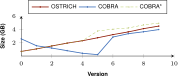
<figcaption markdown="block">
BEAR-A
</figcaption>
</figure>

<figure id="ingestion-size-bearbd" class="subfigure">
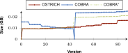
<figcaption markdown="block">
BEAR-B Daily
</figcaption>
</figure>

<figure id="ingestion-size-bearbh" class="subfigure">
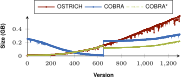
<figcaption markdown="block">
BEAR-B Hourly
</figcaption>
</figure>

<figcaption markdown="block">
Cumulative storage sizes for BEAR-A, BEAR-B Daily, and BEAR-B Hourly under the different storage approaches.
COBRA requires less storage space than OSTRICH for BEAR-A and BEAR-B Hourly.
The middle snapshot always leads to a significant increase in storage size.
</figcaption>
</figure>

<figure id="ingestion-time" class="figure">

<figure id="ingestion-time-beara" class="subfigure">
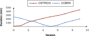
<figcaption markdown="block">
BEAR-A
</figcaption>
</figure>

<figure id="ingestion-time-bearbd" class="subfigure">
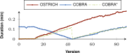
<figcaption markdown="block">
BEAR-B Daily
</figcaption>
</figure>

<figure id="ingestion-time-bearbh" class="subfigure">
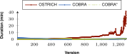
<figcaption markdown="block">
BEAR-B Hourly
</figcaption>
</figure>

<figure id="ingestion-time-bearbh-log" class="subfigure">
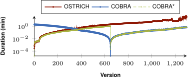
<figcaption markdown="block">
BEAR-B Hourly (Logarithmic Y axis)
</figcaption>
</figure>

<figcaption markdown="block">
Ingestion times per version for BEAR-A, BEAR-B Daily, and BEAR-B Hourly under the different storage approaches.
COBRA resets ingestion time from the snapshot version, while ingestion time for OSTRICH keeps increasing.
</figcaption>
</figure>

In order to provide more details on the evolution of storage size and ingestion time of COBRA(*) compared to OSTRICH,
 shows the cumulative storage size for the different datasets,
and  shows the ingestion time for these datasets.
Note that COBRA is ingested out of order, which means that the first half of the delta chain is ingested first in reverse order,
and the second half of the delta chain is ingested after that in normal order.
These figures show the impact of the middle snapshots within the bidirectional chain.
For BEAR-A, storage size for COBRA lowers in the second half of the delta chain,
which shows that a snapshot with reversed deltas pointing to it (COBRA) requires less storage space
compared to continued use of aggregated deltas (OSTRICH).
For BEAR-B Daily, the storage size significantly increases for the second half of the delta chain,
but for BEAR-B hourly it decreases.
For all datasets, COBRA ingestion times reset to low values from the middle version.
Especially for BEAR-B Hourly we see a significant decrease in ingestion time for COBRA compared to OSTRICH.
While OSTRICH experiences major performance issues from around version 1100,
the ingestion times of COBRA are much lower, which clearly shows the benefit of the bidirectional delta chain.

Finally,  shows the fix-up times,
which are measured as a separate offline process,
together with their additional cost relative to out of order ingestion.
The fix-up time is the time it would take to transition from the COBRA\* to COBRA storage approach,
when the versions cannot be inserted out of order.
While this fix-up requires only 2.39 times more time relative to the overhead of COBRA compared to COBRA* for BEAR-B Daily,
it requires more than 200 times more time for BEAR-A and BEAR-B Hourly,
which shows that out-of-order ingestion is still preferred when possible.

<figure id="ingestion-fixup-time" class="table" markdown="1">

| Dataset       | Time          | Overhead cost |
|---------------|:--------------|:--------------|
| BEAR-A        | 9.52 hours    | 203.27x       |
| BEAR-B Daily  | 3.91 minutes  |   2.39x       |
| BEAR-B Hourly | 7.82 hours    | 243.78x       |

<figcaption markdown="block">
Fix-up duration for the different datasets,
together with its cost relative to the overhead of COBRA compared to COBRA*.
</figcaption>
</figure>

#### Query Evaluation

, , and 
show the query results on BEAR-A for all approaches for respectively VM, DM and VQ.
, , and 
show the same for BEAR-B Daily,
and , , and 
for BEAR-B Hourly.
These query evaluation times are averaged across all query sets for their respective dataset.
For completeness, we included more detailed plots for each query set separately in [the appendix](#appendix).

When purely comparing COBRA and OSTRICH,
the summarizing figures show that for VM queries, COBRA is faster than OSTRICH in BEAR-A,
but for the BEAR-B datasets, COBRA is slightly faster than OSTRICH for the first half of the delta chain,
and becomes slower in the second half.
For DM, COBRA is always equal or faster than OSTRICH when querying within the first half of its delta chain,
but slower for the second half.
For VQ, COBRA is faster than OSTRICH for BEAR-B Hourly, slightly faster for BEAR-B Daily, and slower for BEAR-A.

When also including the HDT and Jena approaches,
we see that for VM queries, HDT-IC is overall faster than all other approaches,
and Jena-based approaches are mostly the slowest.
HDT-CB also starts of about as fast as HDT-IC, but becomes slower for later versions,
and even becomes significantly slower than COBRA and OSTRICH for BEAR-B Hourly that has many versions.
For DM queries, HDT-IC is slightly faster than COBRA and OSTRICH.
Again, Jena-based approaches are significantly slower,
and HDT-CB again starts off fast, but becomes slower for later versions.
For VQ queries, COBRA and OSTRICH are faster than all other approaches,
except for BEAR-A where the HDT-based approaches achieve similar performance.

<figure id="results-beara-vm-sumary">
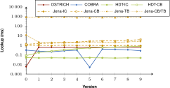
<figcaption markdown="block">
Median BEAR-A VM query results for all triple patterns for all versions.
</figcaption>
</figure>

<figure id="results-beara-dm-summary">
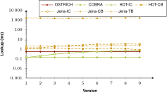
<figcaption markdown="block">
Median BEAR-A DM query results for all triple patterns from version 0 to all other versions.
</figcaption>
</figure>

<figure id="results-beara-vq-summary">
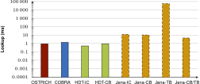
<figcaption markdown="block">
Median BEAR-A VQ query results for all triple patterns.
</figcaption>
</figure>

<figure id="results-bearb-daily-vm-sumary">
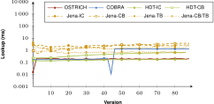
<figcaption markdown="block">
Median BEAR-B-daily VM query results for all triple patterns for all versions.
</figcaption>
</figure>

<figure id="results-bearb-daily-dm-summary">
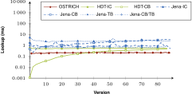
<figcaption markdown="block">
Median BEAR-B-daily DM query results for all triple patterns from version 0 to all other versions.
</figcaption>
</figure>

<figure id="results-bearb-daily-vq-summary">
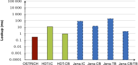
<figcaption markdown="block">
Median BEAR-B-daily VQ query results for all triple patterns.
</figcaption>
</figure>

<figure id="results-bearb-hourly-vm-sumary">
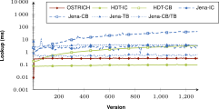
<figcaption markdown="block">
Median BEAR-B-hourly VM query results for all triple patterns for all versions.
</figcaption>
</figure>

<figure id="results-bearb-hourly-dm-summary">
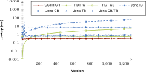
<figcaption markdown="block">
Median BEAR-B-hourly DM query results for all triple patterns from version 0 to all other versions.
</figcaption>
</figure>

<figure id="results-bearb-hourly-vq-summary">
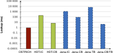
<figcaption markdown="block">
Median BEAR-B-hourly VQ query results for all triple patterns.
</figcaption>
</figure>

### Result analysis
{:#evaluation-discussion}

In this section, we discuss the findings of our results regarding ingestion and query evaluation
when comparing the bidirectional delta chain with a unidirectional delta chain,
we test our hypotheses,
and we discuss the overall comparison of different archiving approaches.

#### Ingestion

While the unidirectional delta chain leads to increasing ingestion times for every new version,
initiating a new snapshot (COBRA\*) can effectively _reset_ these ingestion times,
and lead to overall lower ingestion times.
The downside is that there can be an increase in storage size due to this,
for datasets that have few small or large versions (BEAR-B Daily and BEAR-A),
otherwise for many small versions (BEAR-B Hourly) there is a decrease in storage size.
As such, for those datasets (BEAR-B Daily and BEAR-A), it is recommended to wait longer before initiating a new snapshot in the delta chain.
Given the capabilities and query load of the server and affordable storage overhead,
a certain ingestion time threshold could be defined,
which would initiate a new snapshot when this threshold is exceeded.

Once there are two unidirectional delta chains,
the first one could optionally be reversed so that both can share one snapshot through a fix-up process (COBRA).
Our results show that this can further reduce storage size for datasets with few large versions (BEAR-A and BEAR-B Hourly),
and even lead to less storage space compared to the continued use of aggregated deltas (OSTRICH).
However, even though there is a reduction of storage size for many small versions (BEAR-B Daily),
this leads to overhead in terms of storage size compared to the unidirectional delta chain (OSTRICH).
This shows that a bidirectional delta chain is more effective for BEAR-A and BEAR-B Hourly compared to the BEAR-B Daily dataset in terms of storage size,
while it is always effective in terms of ingestion time.
The fix-up process for enabling this reversal does however require a significant execution time.
Since this could easily run in a separate offline process in parallel to query execution and the ingestion of next versions,
this additional time is typically not a problem.
As such, when the server encounters a dataset with large versions (millions of triples per version),
then the fix-up approach should be followed.

The results also show that if all versions are known beforehand,
they should be ingested out-of-order into a bidirectional delta chain.
Because this leads to a significantly lower total ingestion time
compared to in-order ingestion followed by the fix-up process.

#### Query Evaluation

Regarding query performance, our results show that the bidirectional delta chain also has a large impact here compared to the unidirectional delta chain.
Since two shorter delta chains lead to two smaller addition and deletion indexes compared to one longer delta chain,
VM and DM times become lower for the dataset with few large versions (BEAR-A), since less data needs to be iterated.
However, for datasets with many small versions (BEAR-B),
we see that VM times become lower or equal for the first half of the bidirectional delta chain,
but becomes slower for the second half.
We see this behaviour also recurring across all datasets for DM queries.
This is because in these cases we need to query within the two parts of the delta chain,
i.e., we need to search through two addition and deletion indexes instead of just one.
For datasets with many small versions (BEAR-B),
VQ also becomes faster with a bidirectional delta chain,
but this does not apply when the dataset has few large versions (BEAR-A).
This is again caused by the fact that we now have two delta chains,
and two addition and deletion indexes to query in.
When we have many small versions, these two delta chains are worth it,
as the benefit of the shared snapshot outweighs the overhead of the delta chains.
However, for few large versions,
the overhead of two delta chains is too large for VQ,
and one delta chain performs better.
In summary, a bidirectional delta chain is effective for optimizing VM (assuming few large versions),
can speedup DM for the first half of all versions, but slow down for the second half,
and is beneficial for VQ (assuming many small versions).

#### Hypotheses

In , we defined research hypotheses,
which we will now answer based on our experimental results.
In our [first hypothesis](#hypothesis-qualitative-storage), we expected storage size
to become lower with a bidirectional delta chain compared to a unidirectional delta chain.
While this is true for BEAR-A and BEAR-B Hourly, this is not true for BEAR-B Daily.
As such, we _reject_ this hypothesis.
In our [second hypothesis](#hypothesis-qualitative-ingestion),
we expected ingestion time to be lower with a bidirectional delta chain,
which was the primary goal of this work.
Our results show that this is true.
As such, we _accept_ this hypothesis.
Our other hypotheses expect that evaluation times for [VM](#hypothesis-qualitative-querying-vm),
[DM](#hypothesis-qualitative-querying-dm) and [VQ](#hypothesis-qualitative-querying-vq)
with a bidirectional delta chain would be lower.
Our results show that each one of them is true in many cases, but they are not valid across the board,
so we _reject_ each of them.

#### Comparison of Archiving Approaches

In previous work, it was shown that OSTRICH can speed up VM, DM, and VQ queries on average compared to other RDF archiving approaches,
at the cost of higher ingestion times.
Our experimental results for the new bidirectional delta chain approach from COBRA
show that it can significantly reduce ingestion time, and sometimes also ingestion size.
Even though there are these reductions, there are still approaches for which ingestion is significantly faster (Jena-TB, Jena-CB/TB, HDT-IC, HDT-CB)
and storage size is slightly lower (Jena-TB, Jena-CB/TB, HDT-CB).

The results show that HDT-based approaches can perform exceptionally well in certain cases,
but they then perform relatively much worse in other cases.
For instance, HDT-IC performs the best in all cases for VM queries,
but this comes at the cost of very high storage requirements.
Furthermore, HDT-CB performs really well for all queries,
but becomes continuously slower for more versions in the dataset.
Overall, Jena-based approaches are the slowest.
In general, both OSTRICH and COBRA offer a valuable trade-off between these extremes,
with COBRA focusing on reducing the problematically high ingestion times of OSTRICH.
OSTRICH and COBRA are thereby never the optimal solution for all specific cases,
but they perform –on average– sufficiently well for all different cases,
which is not the case for the other approaches.
