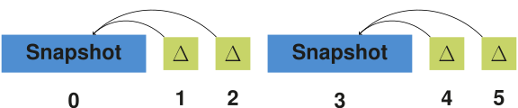
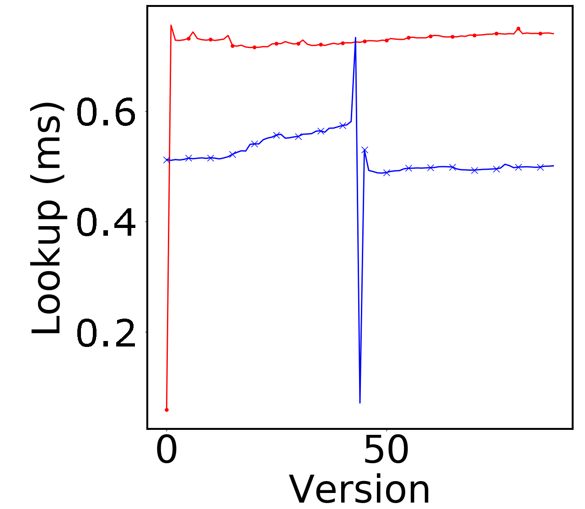
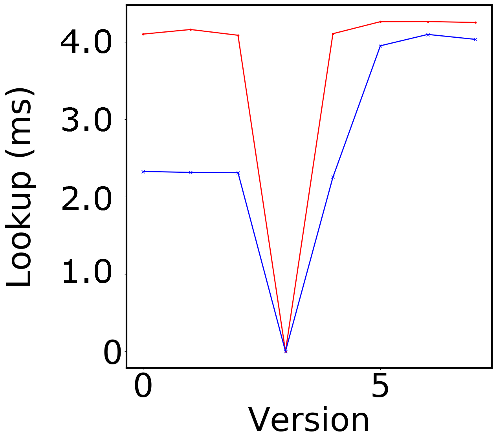
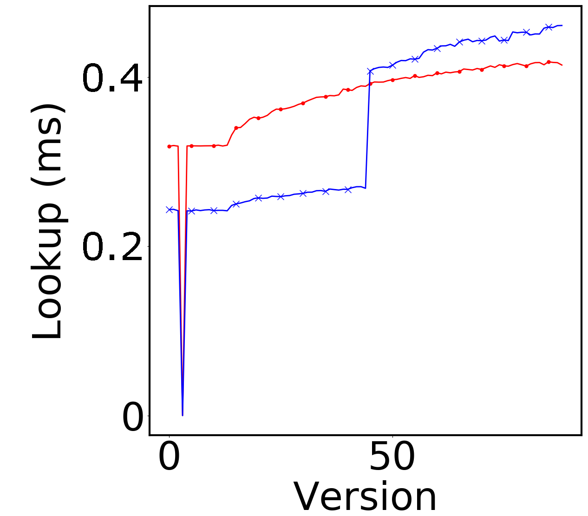

## Evaluation
{:#evaluation}

In this section, we evaluate our bidirectional archiving approach by comparing our implementation to native OSTRICH.

### Implementation
{:#evaluation-implementation}

We have implemented our storage approach and query algorithms as a tool called COBRA (Change-Based Offset-Enabled Bidirectional RDF Archive).
COBRA is an extension of OSTRICH, has been implemented in C/C++, and is available under the MIT license on [GitHub](https://github.com/rdfostrich/cobra){:.mandatory}.
Our implementation uses [HDT](cite:cites hdt) as snapshot technology,
and makes use of the highly efficient memory-mapped B+Tree implementation [Kyoto Cabinet](http://fallabs.com/kyotocabinet/){:.mandatory} for storing our indexes.
The delta dictionary is encoded with [gzip](http://www.gzip.org/), which requires decompression during querying and ingestion.

### Experimental Setup
{:#evaluation-setup}

In order to evaluate the ingestion and triple pattern query execution of COBRA,
we make use of the [BEAR benchmark](https://aic.ai.wu.ac.at/qadlod/bear.html){:.mandatory}.
To test the scalability of our approach for datasets with few and large versions, we use the BEAR-A benchmark.
We use the first eight versions of the BEAR-A dataset (more versions cause memory issues),
which contains 30M to 66M triples per version.
This dataset was compiled from the [Dynamic Linked Data Observatory](http://swse.deri.org/dyldo/).
To test for datasets with many smaller versions, we use BEAR-B with the daily and hourly granularities.
For the daily dataset we use 89 versions and for hourly dataset 400 versions,
both of them have around 48K triples per version.
All experiments were performed on a 64-bit Ubuntu 14.04 machine with a 6-core 2.40 GHz CPU and 48 GB of RAM.
Our experimental setup and its raw results are available on [GitHub](https://github.com/rdfostrich/cobra/tree/master/Experiments/){:.mandatory}.

Considering we aim to measure the benefits of the bidirectional aggregated delta chain
compared to the unidirectional aggregated delta chain under the hybrid storage strategy,
we distinguish between the following storage approaches:

* **OSTRICH**: Forward unidirectional aggregated delta chain ()
* **COBRA\***: Bidirectional aggregated delta chain before fix-up ()
* **COBRA**: Bidirectional aggregated delta chain after fix-up ()

As such, we consider comparing against other systems with different storage strategies out of scope for this work.
For an extensive comparison of the hybrid storage strategy with other systems, we refer to the [OSTRICH article](cite:cites ostrich).

<figure id="evaluation-storage-approaches" class="figure">

<figure id="evaluation-storage-approaches-ostrich" class="subfigure">

<figcaption markdown="block">
OSTRICH with a forward unidirectional aggregated delta chain &nbsp;&nbsp;&nbsp;
</figcaption>
</figure>

<figure id="evaluation-storage-approaches-cobra-star" class="subfigure">

<figcaption markdown="block">
COBRA* with a bidirectional aggregated delta chain *before* fix-up &nbsp;&nbsp;&nbsp;
</figcaption>
</figure>

<figure id="evaluation-storage-approaches-cobra" class="subfigure">

<figcaption markdown="block">
COBRA with a bidirectional aggregated delta chain *after* fix-up (ingested out-of-order starting with snapshot)
</figcaption>
</figure>

<figcaption markdown="block">
The different storage approaches used in our experiments for an arbitrary dataset with six versions.
</figcaption>
</figure>

In the scope of this work, we work with at most two delta chains.
For simplicity of these experiments, we always start a new delta chain in the middle version of the dataset
(4 for BEAR-A, 45 for BEAR-B Daily, 200 for BEAR-B Hourly).
Note that for the COBRA storage approach, we assume that all versions are available beforehand,
so they can be stored out of order, starting with the middle snapshot.
For example, following the out-of-order ingestion algorithm from ,
for BEAR-A, this will first lead to the creation of a snapshot for version 4,
the creation of a reverse delta chain for versions 0-3,
and finally the creation of a forward delta chain for versions 5-8.
In practise, this may not always be possible, which is why we report on the additional fix-up time during ingestion separately
that would be required when ingestion in order (COBRA\*).

To evaluate triple pattern query performance,
we make use of the query sets provided by BEAR.
BEAR-A provides 7 query sets containing around 100 triple patterns that are further divided into high result cardinality and low result cardinality. 
BEAR-B provides two query sets that contain `?P?` and `?PO` queries.
We evaluate these queries as VM queries for all version, DM queries between the first and all other versions and a VQ query.
In order to minimize outliers, we replicate the queries five times and take the mean results.
Furthermore, we perform a warm-up period before the first query of each triple pattern.
Since neither OSTRICH nor COBRA support multiple snapshots for all query atoms,
we limit our experiments to OSTRICH’s unidrectional storage layout and COBRA’s bidirectional storage layout.

### Measurements
{:#evaluation-results}

In this section, we discuss the results of our experiments on ingestion and query evaluation,
which we then analyze in the next section.

#### Ingestion

 shows the total storage sizes and ingestion times
for BEAR-A, BEAR-B Daily, and BEAR-B Hourly under the different storage approaches.
This table shows that COBRA requires less ingestion time than OSTRICH in all cases (41% less on average).
Furthermore, COBRA requires less storage space than OSTRICH for BEAR-A and BEAR-B Hourly, but not for BEAR-B Daily.
COBRA* requires more storage space than both COBRA and OSTRICH with BEAR-A, but it requires less ingestion time.
For BEAR-B Daily, OSTRICH requires less storage, but COBRA* has the lowest ingestion time.
For BEAR-B Hourly, COBRA* is lower in terms of storage size and ingestion time than both COBRA and OSTRICH.

<figure id="ingestion-total" class="table" markdown="1">

|                          | OSTRICH | COBRA*  | COBRA  |
|--------------------------|:--------|:--------|:-------|
| **BEAR-A** | | |
| Size (GB)        | 3.92    | 4.31    | *3.36* |
| Time (hours)   | 23.66   | *12.92* | 14.63  |
| **BEAR-B Daily** | | |
| Size (MB)        | *19.37* | 26.01   | 28.44  |
| Time (minutes) | 6.53    | *3.28*  | 4.24   |
| **BEAR-B Hourly** | | |
| Size (MB)        | 61.02   | *46.42* | 53.26  |
| Time (minutes) | 34.47   | *14.87* | 18.30  |

<figcaption markdown="block">
Total storage size and ingestion time for the different datasets.
COBRA* is always the fastest, with no consistent winner for total storage size.
</figcaption>
</figure>

<figure id="ingestion-size" class="figure">

<figure id="ingestion-size-beara" class="subfigure">

<figcaption markdown="block">
BEAR-A
</figcaption>
</figure>

<figure id="ingestion-size-bearbd" class="subfigure">

<figcaption markdown="block">
BEAR-B Daily
</figcaption>
</figure>

<figure id="ingestion-size-bearbh" class="subfigure">

<figcaption markdown="block">
BEAR-B Hourly
</figcaption>
</figure>

<figcaption markdown="block">
Cumulative storage sizes for BEAR-A, BEAR-B Daily, and BEAR-B Hourly under the different storage approaches.
COBRA requires less storage space than OSTRICH for BEAR-A.
For BEAR-B Daily and Hourly, the middle snapshot leads to a significant increase in storage size.
</figcaption>
</figure>

<figure id="ingestion-time" class="figure">

<figure id="ingestion-time-beara" class="subfigure">

<figcaption markdown="block">
BEAR-A
</figcaption>
</figure>

<figure id="ingestion-time-bearbd" class="subfigure">

<figcaption markdown="block">
BEAR-B Daily
</figcaption>
</figure>

<figure id="ingestion-time-bearbh" class="subfigure">

<figcaption markdown="block">
BEAR-B Hourly
</figcaption>
</figure>

<figcaption markdown="block">
Ingestion times per version for BEAR-A, BEAR-B Daily, and BEAR-B Hourly under the different storage approaches.
COBRA resets ingestion time from the snapshot version, while ingestion time for OSTRICH keeps increasing.
</figcaption>
</figure>

In order to provide more details on the evolution of storage size and ingestion time,
 shows the cumulative storage size for the different datasets,
and  shows the ingestion time for these datasets.
These figures show the impact of the middle snapshots within the bidirectional chain.
For BEAR-A, storage size for COBRA lowers at the middle version,
which shows that a snapshot with reversed deltas pointing to it (COBRA) requires less storage space
compared to continued use of aggregated deltas (OSTRICH).
For BEAR-B Daily and Hourly, the storage size significantly increases at the middle version,
but the ingestion times for all later versions reset to low values.

Finally,  shows the fix-up times,
which are measured as a separate offline process.
This is the time it would take to transition from the COBRA\* to COBRA storage approach,
when the versions cannot be inserted out of order.
On average, this fix-up requires 3,6 times more time relative to the overhead of COBRA compared to COBRA*,
showing that out-of-order ingestion is still preferred when possible.

<figure id="ingestion-fixup-time" class="table" markdown="1">

| Dataset       | Time          |
|---------------|:--------------|
| BEAR-A        | 8.38 hours    |
| BEAR-B Daily  | 2.48 minutes  |
| BEAR-B Hourly | 11.41 minutes |

<figcaption markdown="block">
Fix-up duration for the different datasets.
</figcaption>
</figure>

#### Query Evaluation

,  and  show the query evaluation times
for COBRA (after fix-up) and OSTRICH for respectively VM, DM and VQ.
These figures show that for VM, COBRA is faster than OSTRICH minus a few outliers around the middle version.
For DM, COBRA is always faster than OSTRICH when querying within the first half of its delta chain.
For the second half, COBRA becomes slower, and for BEAR-B Daily even becomes slower than OSTRICH.
For VQ, COBRA is faster than OSTRICH for BEAR-B Hourly, slightly faster for BEAR-B Daily, and slower for BEAR-A.

<figure id="query-vm" class="figure">

<figure id="query-vm-beara" class="subfigure">

<figcaption markdown="block">
BEAR-A
</figcaption>
</figure>

<figure id="query-vm-bearbd" class="subfigure">

<figcaption markdown="block">
BEAR-B Daily
</figcaption>
</figure>

<figure id="query-vm-bearbh" class="subfigure">

<figcaption markdown="block">
BEAR-B Hourly
</figcaption>
</figure>

<figcaption markdown="block">
Version Materialization evaluation times per version for BEAR-A, BEAR-B Daily, and BEAR-B Hourly under the different storage approaches.
For most versions, COBRA is faster than OSTRICH.
</figcaption>
</figure>

<figure id="query-dm" class="figure">

<figure id="query-dm-beara" class="subfigure">

<figcaption markdown="block">
BEAR-A
</figcaption>
</figure>

<figure id="query-dm-bearbd" class="subfigure">

<figcaption markdown="block">
BEAR-B Daily
</figcaption>
</figure>

<figure id="query-dm-bearbh" class="subfigure">

<figcaption markdown="block">
BEAR-B Hourly
</figcaption>
</figure>

<figcaption markdown="block">
Delta Materialization evaluation times between the first version and all other versions
for BEAR-A, BEAR-B Daily, and BEAR-B Hourly under the different storage approaches.
For the first half of versions, COBRA is faster than OSTRICH, but slows down in the second half.
</figcaption>
</figure>

<figure id="query-vq" class="figure">

<figure id="query-vq-beara" class="subfigure">

<figcaption markdown="block">
BEAR-A
</figcaption>
</figure>

<figure id="query-vq-bearbd" class="subfigure">

<figcaption markdown="block">
BEAR-B Daily
</figcaption>
</figure>

<figure id="query-vq-bearbh" class="subfigure">

<figcaption markdown="block">
BEAR-B Hourly
</figcaption>
</figure>

<figcaption markdown="block">
Version Query evaluation times across all versions for BEAR-A, BEAR-B Daily, and BEAR-B Hourly under the different storage approaches.
COBRA is faster than OSTRICH for the BEAR-B datasets, but slower for BEAR-A.
</figcaption>
</figure>

 show the average overall query evaluation times for BEAR-A, BEAR-B Daily and BEAR-B Hourly.
This shows that on average, COBRA is faster than OSTRICH,
except for VQ in BEAR-A.

<figure id="query-avg" class="table" markdown="1">

|               | VM      | DM      | VQ     |
|---------------|:--------|:--------|:-------|
| **BEAR-A** | | |
| OSTRICH       | 5.64    | 4,15    | *8,60*  |
| COBRA         | *4.37*  | *2,93*  | 10,62   |
| **BEAR-B Daily** | | |
| OSTRICH       | 0,71    | 0,38    | 0.90    |
| COBRA         | *0,51*  | *0,31*  | *0.89*  |
| **BEAR-B Hourly** | | |
| OSTRICH       | 0.73    | 0.27    | 1,72    |
| COBRA         | *0.53*  | *0.19*  | *1,34*  |

<figcaption markdown="block">
Average query evaluation times for OSTRICH and COBRA for VM, DM and VQ for the different datasets (ms).
</figcaption>
</figure>

### Result analysis
{:#evaluation-discussion}

In this section, we discuss the findings of our results regarding ingestion and query evaluation,
and we test our hypotheses.

#### Ingestion

Our experimental results show that the usage of a bidirectional delta chain has a significant beneficial impact
on storage size and ingestion time compared to a unidirectional delta chain.
While the unidirectional delta chain leads to increasing ingestion times for every new version,
initiating a new snapshot (COBRA\*) can effectively _reset_ these ingestion times.
The downside of this is that there can be an increase in storage size due to this,
which is more significant for datasets that have many small (few triples and a low change ratio) versions (BEAR-B).
As such, for those datasets (BEAR-B), it is recommended to wait longer before initiating a new snapshot in the delta chain,
since ingestion times are typically much lower compared to datasets with fewer large (many triples and a high change ratio) versions (BEAR-A).
Given the capabilities and query load of the server and affordable storage overhead,
a certain ingestion time threshold could be defined,
which would initiate a new snapshot when this threshold is exceeded.

Once there are two unidirectional delta chains,
the first one could optionally be reversed so that both can share one snapshot through a fix-up process (COBRA).
Our results show that this can further reduce storage size for datasets with few large versions (BEAR-A),
and even lead to less storage space compared to the continued use of aggregated deltas (OSTRICH).
However, for many small versions (BEAR-B), this leads to overhead in terms of storage size.
This shows that a bidirectional delta chain is more effective for BEAR-A compared to the BEAR-B datasets in terms of storage size,
while it is always effective in terms of ingestion time.
The fix-up process for enabling this reversal does however require a significant execution time.
Since this could easily run in a separate offline process,
this additional time is typically not a problem.
As such, when the server encounters a dataset with large versions (millions of triples per version),
then the fix-up approach should be followed.

The results also show that if all versions are known beforehand,
they should be ingested out-of-order into a bidirectional delta chain.
Because this leads to a significantly lower total ingestion time
compared to in-order ingestion followed by the fix-up process.

#### Query Evaluation

Regarding query performance, our results show that the bidirectional delta chain also has a large impact here.
Since two shorter delta chains lead to two smaller addition and deletion indexes compared to one longer delta chain,
VM and DM times become lower, since less data needs to be iterated.
We see that DM times for the second half of the bidirectional delta chain become slower compared to the first half.
This is because in these cases we need to query within the two parts of the delta chain,
i.e., we need to search through two addition and deletion indexes instead of just one.
For datasets with many small versions (BEAR-B),
VQ also becomes faster with a bidirectional delta chain,
but this does not apply when the dataset has few large versions (BEAR-A).
This is again caused by the fact that we now have two delta chains,
and two addition and deletion indexes to query in.
When we have many small versions, these two delta chains are worth it,
as the benefit of the shared snapshot outweighs the overhead of the delta chains.
However, for few large versions,
the overhead of two delta chains is too large for VQ,
and one delta chain performs better.
In summary, a bidirectional delta chain is most effective for optimizing VM,
largely beneficial for DM,
and beneficial for VQ (assuming many small versions).

#### Hypotheses

In , we defined research hypotheses,
which we will now answer based on our experimental results.
In our [first hypothesis](#hypothesis-qualitative-storage), we expected storage size
to become lower with a bidirectional delta chain compared to a unidirectional delta chain.
While this is true for BEAR-A and BEAR-B Hourly, this is not true for BEAR-B Daily.
As such, we _reject_ this hypothesis.
In our [second hypothesis](#hypothesis-qualitative-ingestion),
we expected ingestion time to be lower with a bidirectional delta chain.
Our results show that this is true.
As such, we _accept_ this hypothesis.
Our other hypotheses expect that evaluation times for [VM](#hypothesis-qualitative-querying-vm),
[DM](#hypothesis-qualitative-querying-dm) and [VQ](#hypothesis-qualitative-querying-vq)
with a bidirectional delta chain would be lower.
Our results show that this is true, expect for VQ.
As such, we _accept_ our [third](#hypothesis-qualitative-querying-vm) and [fourth](#hypothesis-qualitative-querying-dm) hypothesis,
and _reject_ our [fifth](#hypothesis-qualitative-querying-vq) hypothesis.
