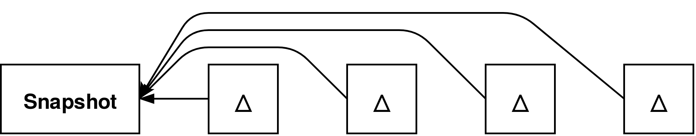
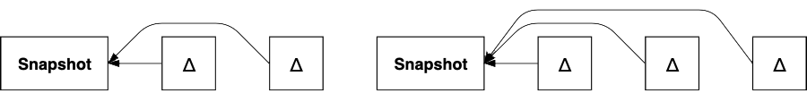
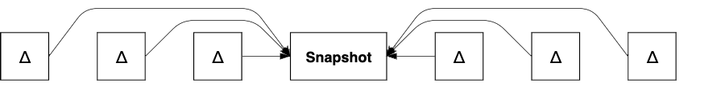
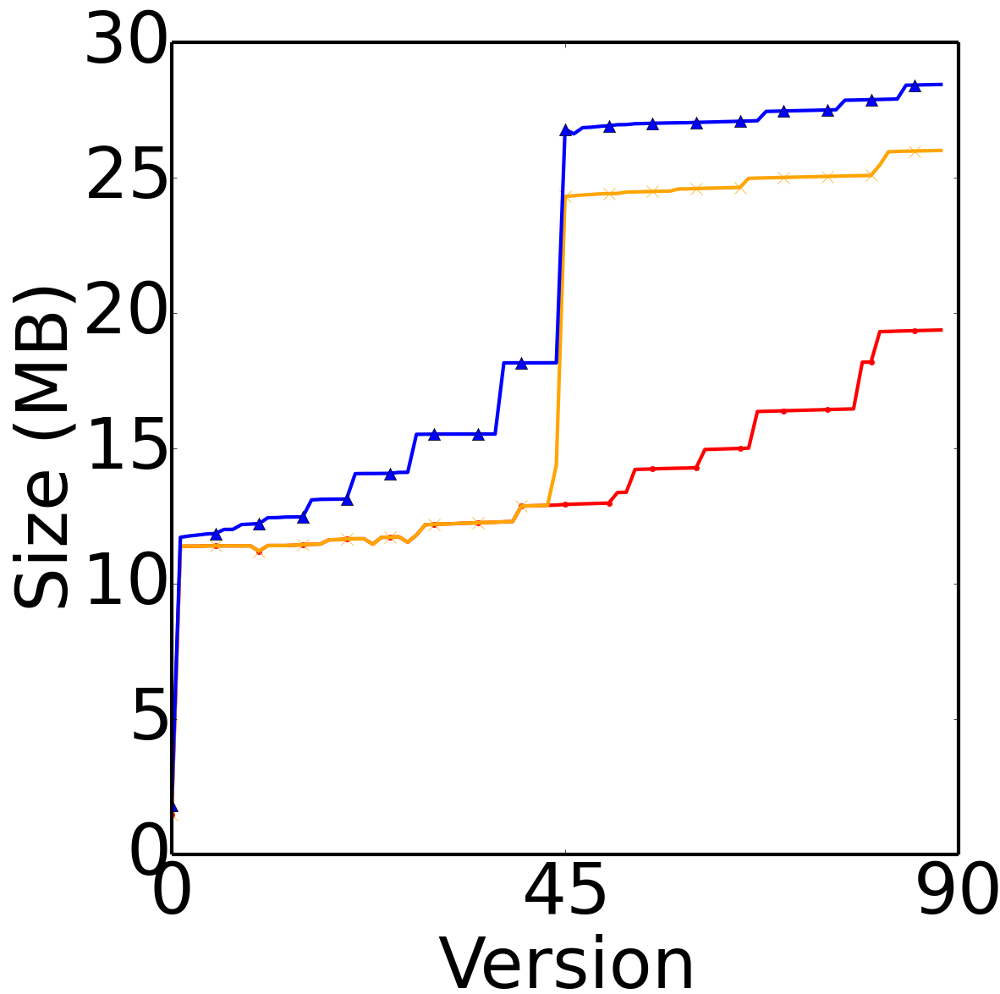
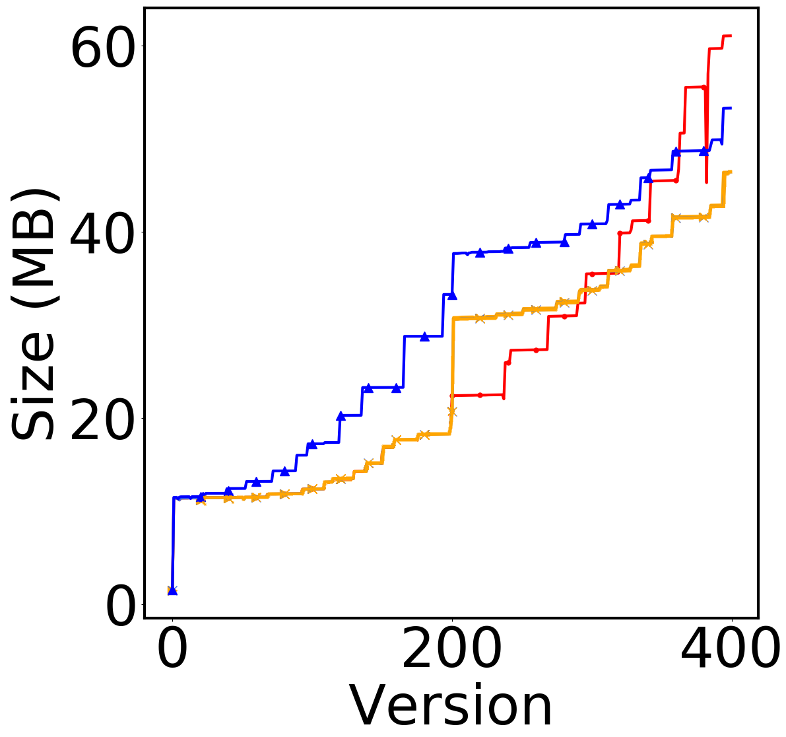
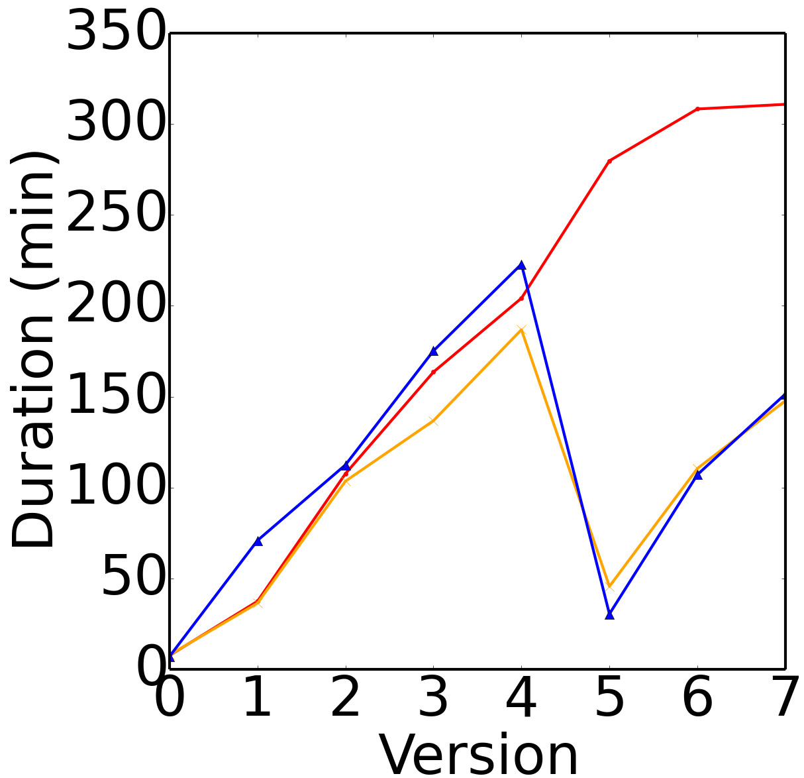

## Evaluation
{:#evaluation}

In this section, we evaluate our bidirectional archiving approach by comparing our implementation to native OSTRICH.

### Implementation
{:#evaluation-implementation}

We have implemented our storage approach and query algorithms in a tool called COBRA (Change-Based Offset-Enabled Bidirectional RDF Archive).
COBRA is an extension of OSTRICH, has been implemented in C/C++, and is available under the MIT license on [GitHub](https://github.com/rdfostrich/cobra){:.mandatory}.
Our implementation uses [HDT](cite:cites hdt) as snapshot technology,
and makes use of the highly efficient memory-mapped B+Tree implementation [Kyoto Cabinet](http://fallabs.com/kyotocabinet/){:.mandatory} for storing our indexes.
The delta dictionary is encoded with [gzip](http://www.gzip.org/), which requires decompression during querying and ingestion.

### Experimental Setup
{:#evaluation-setup}

In order to evaluate the ingestion and triple pattern query execution of COBRA,
we make use of the [BEAR benchmark](https://aic.ai.wu.ac.at/qadlod/bear.html){:.mandatory}.
To test the scalability of our approach for datasets with few and large versions, we use the BEAR-A benchmark.
We use the ten eight versions of the BEAR-A dataset (more versions cause memory issues),
which contains 30M to 66M triples per version.
This dataset was compiled from the [Dynamic Linked Data Observatory](http://swse.deri.org/dyldo/).
To test for datasets with many smaller versions, we use BEAR-B with the daily and hourly granularities.
The daily dataset contains 89 versions and the hourly dataset contains 1,299 versions,
both of them have around 48K triples per version.
All experiments were performed on a 64-bit Ubuntu 14.04 machine with a 6-core 2.40 GHz CPU and 48 GB of RAM.
Our experimental setup and its raw results are available on [GitHub](https://github.com/rdfostrich/cobra/tree/master/Experiments/Results){:.mandatory}.

During our experiments, we distinguish between the following storage approaches:

* **OSTRICH**: OSTRICH with a forward unidirectional aggregated delta chain ()
* **COBRA\***: COBRA with a bidirectional aggregated delta chain before fix-up ()
* **COBRA**: COBRA with a bidirectional aggregated delta chain after fix-up ()

In the scope of this work, we work with at most two delta chains.
For simplicity of these experiments, we always start a new delta chain in the middle version of the dataset
(4 for BEAR-A, 45 for BEAR-B Daily, 200 for BEAR-B Hourly).
Note that for the COBRA storage approach, we assume that all versions are available beforehand,
so they can be stored out of order, starting with the middle snapshot.
In practise, this may not always be possible, which is why we report on the additional fix-up time during ingestion separately
that would be required when ingestion in order (COBRA\*).

<figure id="evaluation-storage-approaches" class="figure">

<figure id="evaluation-storage-approaches-ostrich" class="subfigure">

<figcaption markdown="block">
OSTRICH with a forward unidirectional aggregated delta chain
</figcaption>
</figure>

<figure id="evaluation-storage-approaches-cobra-star" class="subfigure">

<figcaption markdown="block">
COBRA with a bidirectional aggregated delta chain before fix-up
</figcaption>
</figure>

<figure id="evaluation-storage-approaches-cobra" class="subfigure">

<figcaption markdown="block">
COBRA with a bidirectional aggregated delta chain after fix-up (ingested out-of-order starting with snapshot)
</figcaption>
</figure>

<figcaption markdown="block">
The different storage approaches used in our experiments.
</figcaption>
</figure>

To evaluate triple pattern query performance,
we make use of the query sets provided by BEAR.
BEAR-A provides 7 query sets containing around 100 triple patterns that are further divided in high result cardinality and low result cardinality. 
BEAR-B provides two query sets that contain ?P? and ?PO queries.
We evaluate these queries as VM queries for all version, DM queries between all versions and a VQ query.
In order to minimize outliers, we replicate the queries five times and take the mean results.
Furthermore, we perform a warm-up period before the first query of each triple pattern.
Since neither OSTRICH nor COBRA support multiple snapshots for all query atoms,
we limit our experiments to OSTRICH’s unidrectional storage layout and COBRA’s bidirectional storage layout.

### Results
{:#evaluation-results}

In this section, we discuss the results of our experiments on ingestion and query evaluation.

#### Ingestion

,  and  show the total storage sizes and ingestion times
for BEAR-A, BEAR-B Daily, and BEAR-B Hourly under the different storage approaches.
These tables show that COBRA less ingestion time than OSTRICH in all cases (41% less on average).
Furthermore, COBRA requires less storage space than OSTRICH for BEAR-A and BEAR-B Hourly, but not for BEAR-B Daily.
COBRA* requires more storage space than both COBRA and OSTRICH with BEAR-A, but it requires less ingestion time.
For BEAR-B Daily, OSTRICH requires less storage, but COBRA* has the lowest ingestion time.
For BEAR-B Hourly, COBRA* is lower in terms of storage size and ingestion time than both COBRA and OSTRICH.

<figure id="ingestion-beara" class="table" markdown="1">

| Approach | Storage Size (GB) | Ingestion Time (hours) |
|----------|:------------------|:-----------------------|
| OSTRICH  | 3.92              | 23.66                  |
| COBRA*   | 4.31              | *12.92*                |
| COBRA    | *3.36*            | 14.63                  |

<figcaption markdown="block">
Total storage size and ingestion time for BEAR-A,
with COBRA requiring the least storage size,
and COBRA* the least ingestion time.
</figcaption>
</figure>

<figure id="ingestion-bearbd" class="table" markdown="1">

| Approach | Storage Size (MB) | Ingestion Time (minutes) |
|----------|:------------------|:-------------------------|
| OSTRICH  | *19.37*           | 6.53                     |
| COBRA*   | 26.01             | *3.28*                   |
| COBRA    | 28.44             | 4.24                     |

<figcaption markdown="block">
Total storage size and ingestion time for BEAR-B Daily,
with COBRA* being the smallest and fastest.
</figcaption>
</figure>

<figure id="ingestion-bearbh" class="table" markdown="1">

| Approach | Storage Size (MB) | Ingestion Time (minutes) |
|----------|:------------------|:-------------------------|
| OSTRICH  | 61.02             | 34.47                    |
| COBRA*   | *46.42*           | *14.87*                  |
| COBRA    | 53.26             | 18.30                    |

<figcaption markdown="block">
Total storage size and ingestion time for BEAR-B Hourly,
with COBRA* being the smallest and fastest.
</figcaption>
</figure>

In order to provide more details on the evolution of storage size and ingestion time,
 shows the cumulative storage size for the different datasets,
and  shows the ingestion time for these datasets.
These figures show the impact of the middle snapshots within the bidirectional chain.
For BEAR-B Daily and Hourly, the storage size significantly increases at the middle version,
but the ingestion times for all later versions significantly reset.

<figure id="ingestion-size" class="figure">

<figure id="ingestion-size-beara" class="subfigure">

<figcaption markdown="block">
BEAR-A
</figcaption>
</figure>

<figure id="ingestion-size-bearbd" class="subfigure">

<figcaption markdown="block">
BEAR-B Daily
</figcaption>
</figure>

<figure id="ingestion-size-bearbh" class="subfigure">

<figcaption markdown="block">
BEAR-B Hourly
</figcaption>
</figure>

<figcaption markdown="block">
Cumulative storage sizes for BEAR-A, BEAR-B Daily, and BEAR-B Hourly under the different storage approaches.
COBRA requires less storage space than OSTRICH for BEAR-A.
For BEAR-B Daily and Hourly, the middle snapshot leads to a significant increase in storage size.
</figcaption>
</figure>

<figure id="ingestion-time" class="figure">

<figure id="ingestion-time-beara" class="subfigure">

<figcaption markdown="block">
BEAR-A
</figcaption>
</figure>

<figure id="ingestion-time-bearbd" class="subfigure">

<figcaption markdown="block">
BEAR-B Daily
</figcaption>
</figure>

<figure id="ingestion-time-bearbh" class="subfigure">

<figcaption markdown="block">
BEAR-B Hourly
</figcaption>
</figure>

<figcaption markdown="block">
Ingestion times per version for BEAR-A, BEAR-B Daily, and BEAR-B Hourly under the different storage approaches.
COBRA resets ingestion time from the snapshot version, while ingestion time for OSTRICH keeps increasing.
</figcaption>
</figure>

Finally,  show the fix-up times,
which are measured as a separate offline process.
This is the time it would take to transition from the COBRA\* to COBRA storage approach,
when the versions could not be inserted out of order.
On average, this fix-up requires 3,6 times more time compared to the additional time out of order ingestion takes.

<figure id="ingestion-fixup-time" class="table" markdown="1">

| Dataset       | Time.         |
|---------------|:--------------|
| BEAR-A        | 8.38 hours    |
| BEAR-B Daily  | 2.48 minutes  |
| BEAR-B Hourly | 11.41 minutes |

<figcaption markdown="block">
Fix-up duration for the different datasets.
</figcaption>
</figure>

#### Query Evaluation

### Discussion
{:#evaluation-discussion}

Write me
{:.todo}

Interestingly, for BEAR-B-Hourly, it is only around version 360 that OSTRICH starts requiring more storage space than COBRA,
which confirms that long delta chains have a negative impact on both storage size and ingestion time.

As such, when out of order ingestion is possible, it is preferred over fix-up.
However, since the fix-up process can happen in an offline process, this additional time is typically not a problem.
