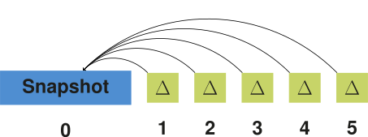
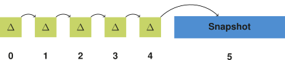
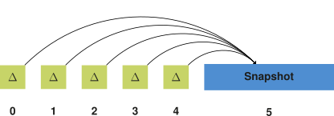
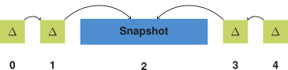
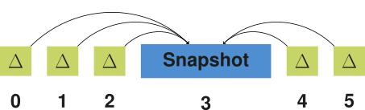
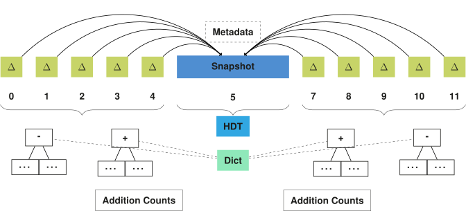

## Bidirectional Delta Chain
{:#solution}

In this section, we explain our bidirectional delta chain approach.
We start by explaining the general idea behind a bidirectional delta chain.
After that, we explain its implication on storage.
Finally, we discuss querying algorithms for the foundational query atoms based on this storage approach.

### Delta Chain Approaches
{:#solution-approaches}

In the scope of this work, we distinguish between 6 different delta chain approaches,
as can be seen in [](#delta-chain-approaches).
We decompose these approaches into 2 axes: _directionality_ and _aggregation_.

<figure id="delta-chain-approaches" class="table" markdown="1">

|   | **Non-aggregated** | **Aggregated** |
|--:|:------------------:|:--------------:|
| **Forward<br> Unidir.** | <span></span> | <span></span> |
| **Reverse<br> Unidir.** | <span></span> | <span></span> |
| **Bidir.**<br>          | <span></span> | <span></span> |
{:.delta-approaches}

<figcaption markdown="block">
Overview of unidirectional forward, unidirectional reverse, and bidirectional delta chain approaches,
both with and without aggregated deltas.
</figcaption>
</figure>

Along the _directionality_ axis, we distinguish 3 forms:

1. The simplest form is the **forward unidirectional** delta chain,
where the snapshot comes first, and is followed by deltas that are relative to the previous delta.
2. The **reverse unidirectional** delta chain is a variant of this where everything is reversed.
Concretely, the snapshot comes last, and is preceded by deltas, where each delta is relative to the next delta.
3. These forward and reverse unidirectional approaches can be combined with each other to form a **bidirectional delta chain**,
where a first set of deltas exist before the snapshot,
and a second set of deltas exists after the snapshot.

Along the _aggregation_ axis, we consider 2 forms:

- In the **non-aggregated form**, each delta is relative to the delta immediately before or after it.
- In the [**aggregated form**](cite:cites vmrdf), each delta is relative to the snapshot before or after it,
where other deltas may occur in-between.

The aggregated delta approach leads to lower version materialization times,
since each delta can be directly applied to a snapshot,
as opposed to non-aggregated deltas where multiple deltas need to be combined before a version can be materialized.
As such, the version materialization time for aggregated deltas is `O(1)` with respect to the number of versions,
while it is `O(n)` for non-aggregated deltas with respect to the number of versions.
This shows how aggregated deltas lead to better query execution times.
The major downside of aggregated deltas is however that storage size increases due to the redundancies between the different deltas.
The longer the delta chain, the larger these redundancies become.

[OSTRICH](cite:cites ostrich) is an example that follows the unidirectional forward aggregated delta chain approach,
while [RCS](cite:cites rcs) (non-RDF-based) follows the unidirectional reverse non-aggregated delta chain approach.
In this work, we will investigate the use of the _bidirectional aggregated_ delta chain approach,
for reasons explained in the next section.

### Motivations for a Bidirectional Delta Chain
{:#solution-bidirectional}

[Experiments on the unidirectional forward aggregated delta chain approach from OSTRICH](cite:cites ostrich)
have shown that this approach leads to ingestion times
that increase linearly with chain length.
This is an expected consequence of the aggregated delta approach,
as they grow in size for each new version.
The goal of this work is to investigate how these problems can be solved,
without losing the advantages of aggregated deltas with respect to query execution times.
We would not achieve any lower ingestion times by reversing our delta chain,
as the additions and deletions would just be swapped, but would not be smaller.
Instead, we aim to reduce overall storage by reducing the number of required snapshots.
<span class="comment" data-author="RV">Slightly confusing: do you aim to reduce ingestion time, or (as in the last sentence) <q>overall storage [size?]</q>?</span>

One straightforward way of reducing ingestion time would be
to create a new snapshot and delta chain once the ingestion time or size becomes too large.
<span class="comment" data-author="RV">Does it though? Because the you'd have to write the whole snapshot, which also takes times?</span>
For instance, we can lower the total ingestion time to half the original time
by splitting one delta chain into two delta chains,
or even to one third by splitting it up into three delta chains.
<span class="comment" data-author="RV">At this point, I wonder whether we need to split off the delta calculation time from number from disk writing time?
This is also where I note that we have not defined ingestion time (and the other parameters). What is the input to the addition process? I presume an entire dataset, so not a diff?</span>
In the extreme, each version would be form its own snapshot,
which would lead to the independent copies storage strategy,
at the cost of increased storage size.
As such, there is a trade-off between ingestion time and storage size,
<span class="comment" data-author="RV">As commented above, I think that would also take a lot of time to write though!</span>
and new delta chains should only be started once ingestion times become much higher than desired.

Since the creation of a snapshot can be costly,
<span class="comment" data-author="RV">Ah, see, exactly my point! But reviewers can make the same point then. It's not a straightforward trade-off, it seems. More like an optimum of the right number of snapshots and deltas.</span>
it should be avoided until absolutely necessary.
As explained in the previous paragraph,
splitting up a delta chain into two separate delta chains
would lead to two snapshots, each followed by a chain of deltas.
We can however reduce the number of required snapshots
by combining the forward and reverse approaches into a *bidirectional* approach,
by allowing two sets of deltas to make use of the same snapshot.
Intuitively, one bidirectional delta chain is equivalent
to two forward delta chains,
where the second delta chain is reversed.
The snapshots of these two chains are therefore shared,
so that it only has to be created and stored once.

As such, the main advantage of a bidirectional delta chain is that it can more optimally make use of snapshots.
Instead of only allowing deltas in one direction to make use of it,
also deltas in the opposite direction can make use of it.
This is especially advantageous for aggregated deltas,
as these grow in size for longer chains.
In the scope of this research,
we continue working with a bidirectional *aggregated* delta chain
due to the non-increasing query execution times for increasing numbers of versions.

<span class="comment" data-author="RV">At this point, you might want to write some remark on how this works time-wise. Because clearly, at moment t=1, I do not know yet what the dataset will look like at t=1+n. So bidirectional assumes that we have a bunch of versions being archived at once?</span>

### Storage Approach
{:#solution-storage}

<span class="rephrase" data-author="RV">As mentioned before, our storage approach builds upon that of OSTRICH.
The only difference is that OSTRICH uses a unidirectional aggregated delta chain,</span>
<span class="comment" data-author="RV">This makes it sound very incremental and non-interesting. Isn't this a fundamental change, that will provide insights in how well this approach works for RDF?</span>
and our approach uses a bidirectional aggregated delta chain.
Concretely, this means that not only deltas exist *after* the snapshot,
but also *before* the snapshot.

<figure id="storage-overview" class="figure">

<figcaption markdown="block">
Overview of the main components of our storage approach consisting of a bidirectional aggregated delta chain.
</figcaption>
</figure>

[](#storage-overview) shows an overview of the main components of our storage approach;
not in particular the delta chain on the left side of the snapshot.
<del class="comment" data-author="RV">Like OSTRICH, </del>the snapshot can be stored using [HDT](cite:cites hdt),
due to its highly performant triple pattern queries, cardinality estimates,
and high compression rate.
Furthermore, metadata about the archive is stored, containing details such as the total number of versions.

Each delta chain is compressed into timestamp-based B+tree indexes,
<span class="comment" data-author="RV">why?</span>
where additions and deletions are stored separately.
<span class="comment" data-author="RV">why?</span>
Each addition and deletion index is stored three times for different triple components orders (SPO, POS, OSP),
to enable efficient triple pattern queries for all possible combinations.
<span class="comment" data-author="RV">OK, got it; might want to start from the need, and then present the solution.</span>
A shared dictionary is used to compress each triple component further.
<span class="comment" data-author="RV">why?</span>
Following the OSTRICH storage approach,
the SPO deletion index contains additional metadata about the relative position of each triple inside the snapshot.
This metadata also allows cardinality estimates for deletions to be retrieved efficiently.
<span class="comment" data-author="RV">Same remark about stating need before solution</span>
To enable cardinality estimates for additions, we make use of the addition count index from OSTRICH.
For the sake of brevity, we omit further details about the components that can be found in the [OSTRICH article](cite:cites ostrich).

### Ingestion Approach
{:#solution-ingestion}

In this section, we introduce an approach to enable ingestion of new versions within our bidirectional aggregated storage approach.
<span class="rephrase" data-author="RV">For this, we make use of the ingestion algorithm from OSTRICH, which enables ingestion within a unidirectional forward aggregated delta chain.
As our approach extends from OSTRICH,</span> we can already insert deltas *after* the snapshot,
but not yet *before* the snapshot, i.e., the reverse part of the delta chain.

Our approach for constructing the reverse delta chain involves a temporary forward delta chain.
This is because we can not start building our reverse delta chain directly,
as we can not predict what triples will be in the snapshot later down the line.
<span class="comment" data-author="RV">cfr. my earlier remark on the time-wise process</span>
For each new version, our temporary forward delta chain will be built up,
and can be queried in the meantime.
From the moment that this delta chain becomes too long, or some other threshold has been exceeded,
then an offline fix-up algorithm is triggered that will effectively *reverse* this delta chain,
and place a snapshot at the end, where a new forward delta chain can be built upon.

<span class="comment" data-author="RV">And what happens at that point? We start a new chain when a new version arrives? (cfr. d11d29c012393c2550604b7fc7a228f8c26fb023)</span>

[](#algorithm-fixup) shows a sketch of our fix-up algorithm in pseudo-code.
First, the aggregated deltas in the chain will be extracted as non-aggregated deltas by calling [existing DM functionality in OSTRICH](https://rdfostrich.github.io/article-jws2018-ostrich/#delta-materialization).
We store the deletions as additions, and the additions as deletions.
Next, we create a new delta chain, and insert these reversed deltas by calling [existing ingestion functionality in OSTRICH](https://rdfostrich.github.io/article-jws2018-ostrich/#ingestions).
Once ingestion is done, the existing delta chain is replaced by our new delta chain.

<figure id="algorithm-fixup" class="algorithm numbered">
````/algorithms/fixup.txt````
<figcaption markdown="block">
Fix-up algorithm for reversing an existing bidirectional aggregated delta chain.
</figcaption>
</figure>

The main advantage of this fix-up approach is that it avoids query unavailability of the archive.
The fix-up algorithm can run at any time, preferably when the server is experiencing a lower query load.
During the execution of this process, the temporary forward delta chain is still available,
so queries are still possible during this time.
Only after the fix-up process is done,
query executions will be delegated to this new reverse delta chain, 
and the temporary forward delta chain can be deleted.

### Query Algorithms
{:#solution-query}

In this section, we discuss triple pattern query algorithms for the three query atoms discussed in [](#related-work) (VM, DM, VQ).
For simplicity, we assume the existence of a (bidirectional) delta chain with one snapshot.
We consider multiple snapshots and delta chains future work.
Just like for OSTRICH, all of these algorithms work in a streaming manner with offset support,
and offer cardinality estimators.
Below, we briefly discuss the relevant parts of the OSTRICH algorithms.
For more details, we refer to the [OSTRICH article](cite:cites ostrich).

#### Version Materialization

Version Materialization (VM) allows retrieval of triples in a given version.
In summary, [OSTRICH enables VM](https://rdfostrich.github.io/article-jws2018-ostrich/#version-materialization)
by either querying a snapshot directly, if the requested version is a snapshot,
or applying a given delta on the closest preceding snapshot otherwise.
In our case, a snapshot can not only exist before a delta, but also after a delta.
Nevertheless, the algorithm itself remains the same as in OSTRICH,
as the delta will have to be applied onto the snapshot in both cases.
As such, we do not discuss this VM case any further.

#### Delta Materialization

Delta Materialization (DM) allows differences between two given versions to be retrieved.
[OSTRICH distinguishes two cases for this](https://rdfostrich.github.io/article-jws2018-ostrich/#delta-materialization);
either the start version is a snapshot or a delta,
where the end version will always be a delta.
If the start (or end) version is a snapshot, then the result is simply a query within the aggregated delta of the end version.
Otherwise, the addition and deletion indexes for the two delta versions are iterated in a sort-merge join-like operation,
and only emits the triples that have a different addition/deletion flag for the two versions.

In our bidirectional storage approach, one additional case can occur:
when the start and end version correspond to deltas in the bidirectional delta chain *before* and *after* the snapshot,
i.e., the DM query crosses the snapshot boundary.
For this, we split up our query into two queries:
a DM query from the start version until the snapshot,
and a DM query from the snapshot until the end version.
These two queries can be resolved over the two respective delta chains using [the existing DM functionality from OSTRICH](https://rdfostrich.github.io/article-jws2018-ostrich/#delta-materialization).
As the results from these two queries are sorted,
we can merge them in a sort-merge join way,
where triples are only emitted if they don't exist in both streams (ignoring the addition/deletion flag).
[](#algorithm-querying-dm) illustrates this algorithm in pseudocode.
Following the patch notation for [DARCS](cite:cites darcs),
with `o` being the start version, `e` being the end version and `s` being the snapshot,
our delta split corresponds to <sup>`o`</sup>`D`<sup>`e`</sup> = <sup>`o`</sup>`D1`<sup>`s`</sup>`D2`<sup>`e`</sup>.

<figure id="algorithm-querying-dm" class="algorithm numbered">
````/algorithms/querying-dm.txt````
<figcaption markdown="block">
Delta Materialization algorithm for triple patterns that produces a triple stream
when the version range crosses the snapshot boundary.
</figcaption>
</figure>

In order to estimate the cardinality of this third case,
the same idea is followed
where the counts of the part of the delta chain before and after the snapshot are added.
Just like the existing DM cardinality estimator from OSTRICH,
this can be an overestimation, since certain triples may occur in both delta chains
that would be omitted from the final result stream.

#### Version Query

A Version Query (VQ) enables querying across all versions,
with results being annotated with the version in which they occur.
[OSTRICH enables VQ](https://rdfostrich.github.io/article-jws2018-ostrich/#version-query)
by iterating over the snapshot for a given triple pattern in a streaming manner.
Every snapshot triple is queried within the deletion index.
For every discovered deletion, their respective version annotations are removed from the result.
If no such deletion value was found, the triple was never deleted, so the versions annotation will contain all versions of the store.
Once the snapshot stream has finished,
the addition index are iterated in a similar way,
where the version annotation of every addition triple is again updated based on its presence in the deletion index.

Our case is a trivial extension of this algorithm.
Instead of checking single addition and deletion streams,
two addition and deletion streams have to be checked.
This will produce distinct version annotations, for which we apply the union.

To estimate the cardinality, the OSTRICH approach can again be extended
by adding the snapshot cardinality with the addition cardinality for both delta chains for the given triple pattern.
As some triples could occur in both delta chains, this can lead to an overestimation.

<span class="comment" data-author="RV">In general, mentions to <q>the OSTRICH approach</q> are a bit confusing, given that we are extending it. It becomes unclear sometimes what properties of OSTRICH are inherited by the new approach, and which ones are not. I think we should give our new approach a name, perhaps OSTRICH-B or so, to emphasize bidirectionality. Or just COBRA, obviously, unless that is specifically the implementation (then again, OSTRICH is, too).</span>
